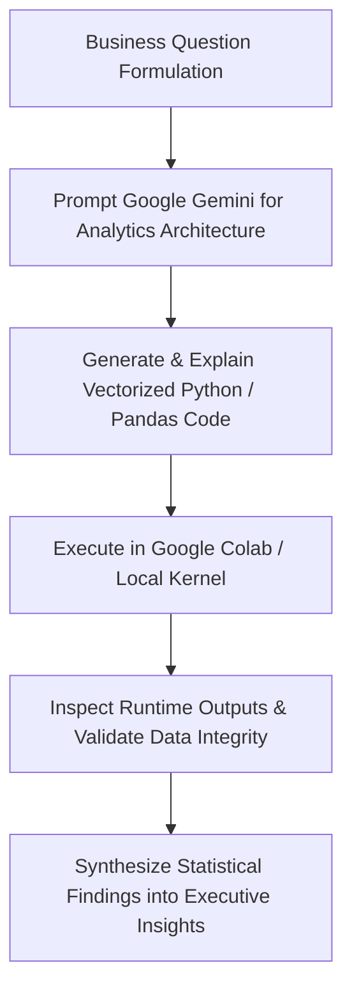

<div align="center">

# 🛒 AI-Powered E-Commerce Customer Segmentation & Sales Intelligence

### *Transforming Multi-Table E-Commerce Transactional Big Data into Predictive Customer Segmentation, Category Prioritization & Regional Commercial Strategy*

[](https://www.python.org/)
[](https://colab.research.google.com/)
[](https://skillsbuild.org/)
[](https://www.aicte-india.org/)
[](https://bharatcares.org/)
[](https://creativecommons.org/licenses/by-nc-sa/4.0/)

---

[📖 Project Overview](#-project-overview) • [🎯 Objectives](#-business-objectives) • [📊 Key Metrics](#-key-empirical-metrics) • [📈 Visualizations](#-visual-intelligence--charts) • [🧩 Customer Segments](#-behavioral-customer-segmentation) • [🔬 Hypothesis Testing](#-statistical-hypothesis-testing) • [💡 Recommendations](#-actionable-business-recommendations) • [🚀 How to Run](#-how-to-run-google-colab--local)

</div>

---

## 📌 Project Overview

This repository contains the complete, production-grade, reproducible data analytics capstone project for the **AICTE | IBM SkillsBuild Data Analytics with AI Internship 2026**, conducted in partnership with **BharatCares**.

Built using the **Brazilian E-Commerce Public Dataset by Olist** from Kaggle, the project establishes an automated intelligence pipeline connecting over **110,000+ completed transactions** across **93,000+ customers** and **27 Brazilian states**. Using Python and **Google Gemini** as an AI analytical co-pilot, raw event logs are transformed into actionable customer segmentation, geographic market prioritization, and category merchandising strategies.

---

## 🏗️ Repository Architecture

```
ai-powered-ecommerce-customer-segmentation/
│
├── README.md                                                 # Main GitHub documentation
├── requirements.txt                                          # Minimal Python dependencies
├── .gitignore                                                # Excludes raw data and local cache
│
├── Anurag_Ranjan_AI_Powered_Ecommerce_Customer_Segmentation.ipynb # Complete 26-Section Jupyter Notebook
├── Anurag_Ranjan_ProjectReport.docx                               # Formal 24-Section Academic Report
├── Anurag_Ranjan_Presentation.pptx                                # 20-Slide Professional Presentation
│
├── build_notebook.py                                         # Programmatic notebook builder
├── generate_report.py                                        # Script to compile DOCX report
├── generate_presentation.py                                  # Script to compile PPTX deck
├── test_and_debug.py                                         # Automated end-to-end test suite
│
├── data/
│   └── README.md                                             # Kaggle dataset setup & download guide
│
└── outputs/
    ├── figures/                                              # High-resolution generated charts
    │   ├── vis1_monthly_sales_trend.png
    │   ├── vis2_top10_product_categories.png
    │   ├── vis3_sales_by_customer_type.png
    │   ├── vis4_top10_brazilian_states.png
    │   └── vis5_top_categories_high_value_repeat.png
    └── tables/                                               # Clean CSV data extracts
```

---

## 🎯 Business Objectives

1. **Longitudinal Sales Dynamics:** Trace monthly and yearly sales trends to isolate seasonal revenue drivers and demand inflection points.
2. **Product Hierarchy Performance:** Rank 70+ product categories by delivered sales value to isolate top revenue contributors.
3. **Customer Behavioral Profiling:** Distinguish between single-purchase and repeat customers, quantifying their average spend differentials.
4. **Behavioral Customer Segmentation:** Construct a 4-quadrant matrix (*High-Value One-time*, *Low-Value One-time*, *High-Value Repeat*, *Low-Value Repeat*) using a verified median sales threshold.
5. **Geographic Sales Mapping:** Evaluate spatial distribution across all 27 Brazilian Federative Units to quantify market concentration.
6. **Cohort Affinity Discovery:** Uncover product category preferences among High-Value Repeat customers.
7. **Inferential Hypothesis Testing:** Validate customer spend differentials using Welch's two-sample t-test ($p < 0.05$).
8. **Data-Driven Strategy:** Formulate actionable retention, merchandising, and regional fulfillment recommendations.

---

## 📊 Key Empirical Metrics

| Metric Dimension | Empirical Benchmark Result | Strategic Significance |
|:---|:---:|:---|
| **Delivered Transactions** | **110,197 line items** | Baseline of verified fulfilled transactions |
| **Unique Customer Reach** | **93,358 buyers** | Unique individuals across Brazil |
| **Total Delivered Sales Value** | **BRL 15,419,773.75** | Combined item price + freight charges |
| **All-Time Peak Sales Month** | **November 2017 (BRL 1,153,364.20)** | Massive Brazilian Black Friday surge |
| **Top Product Category** | **Health & Beauty (BRL 1,412,089.53)** | #1 category by total delivered sales |
| **Repeat Customer Average Spend** | **BRL 308.53** (vs BRL 160.73 one-time) | **1.92x spend premium** for loyal buyers |
| **Top Brazilian State** | **São Paulo / SP (BRL 5,769,703.15)** | **37.42% national market share** |
| **High-Value Cohort Contribution** | **BRL 12,463,585.98 (80.8% of sales)** | **4.22x multiple** over low-value cohort |

---

## 📈 Visual Intelligence & Charts

All visualizations are generated using **Matplotlib** and exported at publication quality (300 DPI) into `outputs/figures/`:

### 1. Monthly Delivered Sales Value Trend
> *Captures longitudinal trajectory and highlights the historic peak in November 2017.*
<div align="center">
  
</div>

---

### 2. Top 10 Product Categories by Delivered Sales Value
> *Health & Beauty, Watches & Gifts, and Bed Bath & Table lead platform gross merchandise value.*
<div align="center">
  
</div>

---

### 3. Sales Value by Customer Type (Repeat vs. One-Time)
> *Repeat buyers generate nearly double the average expenditure per customer.*
<div align="center">
  
</div>

---

### 4. Top 10 Brazilian States by Delivered Sales Value
> *Demonstrates regional concentration in São Paulo, Rio de Janeiro, and Minas Gerais.*
<div align="center">
  
</div>

---

### 5. Top Product Categories for High-Value Repeat Customers
> *Bed Bath & Table and Sports & Leisure dominate repeat customer purchase baskets.*
<div align="center">
  
</div>

---

## 🧩 Behavioral Customer Segmentation

Customers are partitioned into four actionable quadrants using order frequency and a median delivered sales threshold (**BRL 89.81**):

```
                       HIGH VALUE (>= BRL 89.81)
                                  ▲
                                  │
     High-Value One-time          │     High-Value Repeat (VIPs)
     • 44,310 customers (47.5%)   │     • 2,467 customers (2.6%)
     • BRL 11,626,953.48 (75.4%)  │     • BRL 836,632.50 (5.4%)
     • Avg Spend: BRL 262.40      │     • Avg Spend: BRL 339.13
  ◄───────────────────────────────┼──────────────────────────────►
  ONE-TIME (1 Order)              │              REPEAT (>1 Orders)
     Low-Value One-time           │     Low-Value Repeat
     • 46,247 customers (49.5%)   │     • 334 customers (0.4%)
     • BRL 2,928,632.81 (19.0%)   │     • BRL 27,554.96 (0.2%)
     • Avg Spend: BRL 63.33       │     • Avg Spend: BRL 82.50
                                  │
                                  ▼
                        LOW VALUE (< BRL 89.81)
```

> **Strategic Takeaway:** The **High-Value One-time** segment represents **75.40% of all delivered revenue**. Converting even a 2% fraction into repeat buyers yields massive compounding top-line growth.

---

## 🔬 Statistical Hypothesis Testing

```
┌─────────────────────────────────────────────────────────────────────────────┐
│ HYPOTHESIS 1: Welch's Independent Two-Sample t-test                         │
│ H0: Mean Sales (Repeat) == Mean Sales (One-time)                             │
│ H1: Mean Sales (Repeat) > Mean Sales (One-time)                              │
│                                                                             │
│ • Sample Sizes: Repeat = 2,801 | One-time = 90,557                          │
│ • Welch's t-statistic: 24.5016                                              │
│ • p-value: < 0.0001 (numerically approx. 0)                                 │
│ • Decision: REJECT H0 at alpha = 0.05                                       │
│ • Conclusion: Statistically significant spend differential confirmed        │
└─────────────────────────────────────────────────────────────────────────────┘
```

* **Hypothesis 2 (Descriptive Revenue Skew):** High-Value buyers generate **BRL 12.46M** vs. **BRL 2.96M** for Low-Value buyers (**4.22x ratio**).
* **Hypothesis 3 (Spatial Heterogeneity):** State-level revenue ranges from **BRL 5.77M (SP)** to **BRL 9.04K (RR)**, reflecting urbanization and logistics maturity.

---

## 💡 Actionable Business Recommendations

| # | Strategic Initiative | Target Segment / Category | Concrete Implementation Action | Target Business KPI |
|:---:|:---|:---|:---|:---:|
| **1** | **Automated Retention Sequences** | High-Value One-Time (44.3K buyers) | Trigger personalized email sequences 14–30 days post-delivery featuring bundles in Bed Bath & Table and Health & Beauty. | Increase repeat purchase rate from **3.0% to 5.0%** |
| **2** | **High-Margin Category Merchandising** | Top 3 Categories (Health, Watches, Bed Bath) | Deepen vendor partnerships, negotiate bulk procurement margins, and scale promotional ad spend during Q4 Black Friday. | **+15% GMV** growth in target categories |
| **3** | **Regional Micro-Hub Logistics** | Southeast Brazil (SP, RJ, MG - 62.5% sales) | Establish localized 3PL micro-fulfillment fulfillment centers in Greater São Paulo and Rio de Janeiro. | **-20% freight cost** & **-1.5 days** delivery lead time |

---

## 🤖 AI Integration (Google Gemini)

Throughout the analytics lifecycle, **Google Gemini** served as an analytical co-pilot inside Google Colab:



* **Academic Integrity Statement:** AI assisted in algorithmic formulation, visualization design, and narrative drafting. All calculations, p-values, distributions, and metrics were computed directly on the empirical Olist dataset using Python.

---

## 🚀 How to Run (Google Colab & Local)

### Option A: Google Colab (Recommended)

1. Open **[Google Colab](https://colab.research.google.com/)**.
2. Click **File → Open notebook → GitHub** and paste this repository link.
3. Select `Anurag_Ranjan_AI_Powered_Ecommerce_Customer_Segmentation.ipynb`.
4. Download the dataset from [Kaggle Olist Dataset](https://www.kaggle.com/datasets/olistbr/brazilian-ecommerce) and place the CSV files in your Google Drive or `/content/olist_data/`.
5. Update `DATA_PATH = "/content/olist_data/"` in Section 6.
6. Click **Runtime → Run all** (`Ctrl + F9`).

### Option B: Local Setup

```bash
# 1. Clone this repository
git clone https://github.com/YOUR_USERNAME/ai-powered-ecommerce-customer-segmentation-sales-intelligence.git
cd ai-powered-ecommerce-customer-segmentation-sales-intelligence

# 2. Install dependencies
pip install -r requirements.txt

# 3. Download Kaggle dataset files into data/ (see data/README.md)

# 4. Launch Jupyter Notebook
jupyter notebook Anurag_Ranjan_AI_Powered_Ecommerce_Customer_Segmentation.ipynb
```

### Option C: Recompile Deliverables Programmatically

```bash
# Rebuild Jupyter Notebook (.ipynb)
python build_notebook.py

# Recompile Formal Academic Report (DOCX)
python generate_report.py

# Recompile 20-Slide Presentation Deck (PPTX)
python generate_presentation.py

# Run Full Automated Test & Debug Suite
python test_and_debug.py
```

---

## ⚙️ Tech Stack & Dependencies

* **Core Programming:** Python 3.10+
* **Data Manipulation & Analysis:** Pandas, NumPy
* **Data Visualization:** Matplotlib (custom publication theme)
* **Inferential Statistics:** SciPy (`scipy.stats`)
* **AI Analytical Co-pilot:** Google Gemini
* **Document Compilation:** `python-docx`, `python-pptx`

---

## ⚠️ Analytical Limitations

1. **Observational Data:** Statistical correlations (e.g., repeat buyers having higher spend) reflect empirical association, not direct causality.
2. **Temporal Edge Incompleteness:** Early 2016 and late 2018 records contain partial operational coverage; annual growth rates must be interpreted in context.
3. **Threshold Sensitivity:** Customer segmentation was constructed using a median split; alternative clustering methods (e.g., RFM or K-Means) yield different segment boundaries.

---

## 👨‍💻 Project Metadata & Credits

* **Candidate / Student:** Anurag Ranjan
* **Program:** AICTE | IBM SkillsBuild Data Analytics with AI Internship 2026
* **Partner Organization:** BharatCares
* **Dataset Attribution:** Olist Brazilian E-Commerce Public Dataset (Kaggle / CC BY-NC-SA 4.0)

<div align="center">
  <sub>Built with ❤️ for AICTE | IBM SkillsBuild Internship 2026</sub>
</div>
